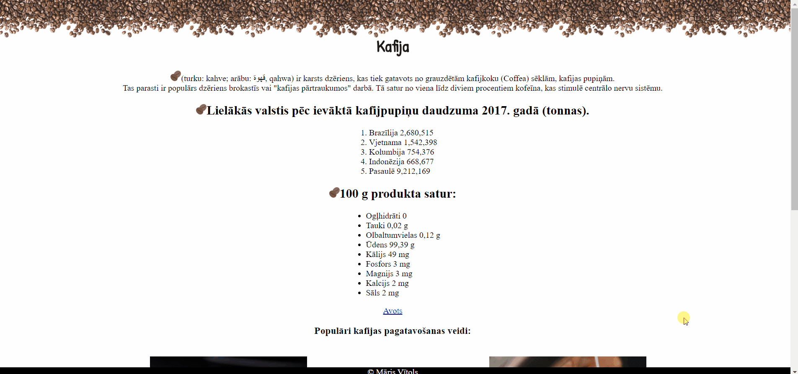

# 1st Riga coding school homework
Live version https://marisqq.github.io/hwork1/

## Homework goals: 
Build a simple index.html page with a tribute to your favorite person/being/animal/place etc.

Your Tribute Page should be valid HTML5 and contain at least the following:

Title in head section

Some metadata in head section

body with

header section
main section
1st level heading
at least 3 paragraphs
at least 2 images
at least one unordered list
at least one ordered list
at least one link to an outside source
at least one internal link
footer section

Validate your .html page with the official W3 validator:
https://validator.w3.org

## Result: 

